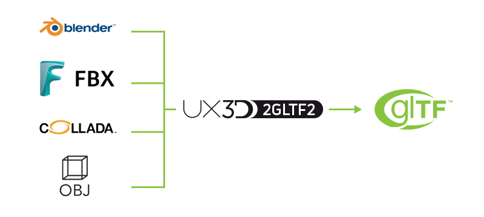

# To glTF 2.0 converter

2gltf2 is a command line tool based on [Blender](http://www.blender.org) and [Blender glTF 2.0 exporter](https://github.com/KhronosGroup/glTF-Blender-Exporter)

Usage: `2gltf2.bat [filename]`

## Software Requirements

* Blender 2.79
* Blender glTF 2.0 exporter

## Supported file formats

